# WeHelp 第五週作業 — MySQL / SQL

> 每題附上 SQL 語句與執行結果截圖。截圖請放在 `week5/screenshots/` 資料夾。
> 資料庫完整匯出檔：[`data.sql`](./data.sql)（用 `mysqldump` 產生）。
---

## Task 2：建立資料庫與資料表

### 建立 `website` 資料庫
```sql
CREATE DATABASE website;
USE website;
```
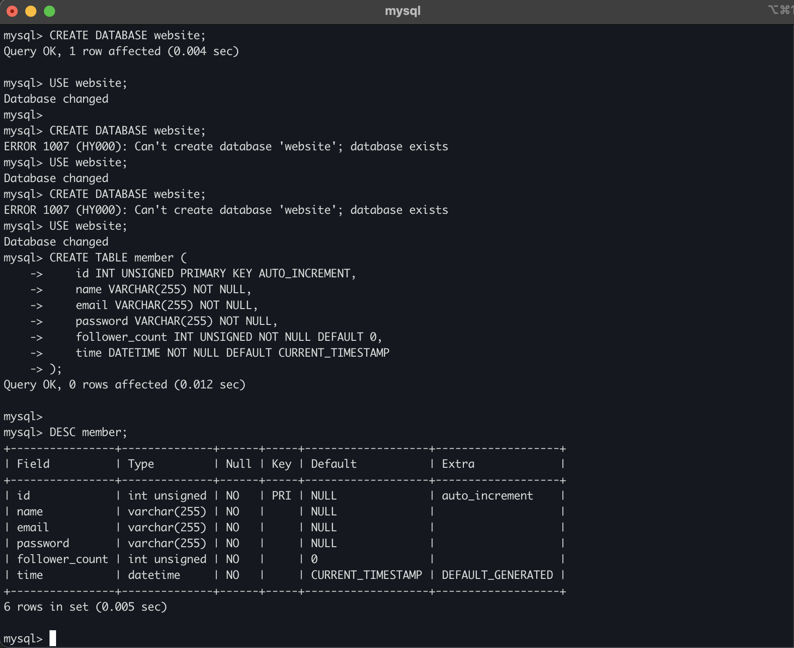

### 建立 `member` 資料表
```sql
CREATE TABLE member (
    id INT UNSIGNED PRIMARY KEY AUTO_INCREMENT,
    name VARCHAR(255) NOT NULL,
    email VARCHAR(255) NOT NULL,
    password VARCHAR(255) NOT NULL,
    follower_count INT UNSIGNED NOT NULL DEFAULT 0,
    time DATETIME NOT NULL DEFAULT CURRENT_TIMESTAMP
);
```

驗證（`DESC member;`）預期結果：

| Field | Type | Null | Key | Default | Extra |
|---|---|---|---|---|---|
| id | int unsigned | NO | PRI | NULL | auto_increment |
| name | varchar(255) | NO | | NULL | |
| email | varchar(255) | NO | | NULL | |
| password | varchar(255) | NO | | NULL | |
| follower_count | int unsigned | NO | | 0 | |
| time | datetime | NO | | CURRENT_TIMESTAMP | DEFAULT_GENERATED |

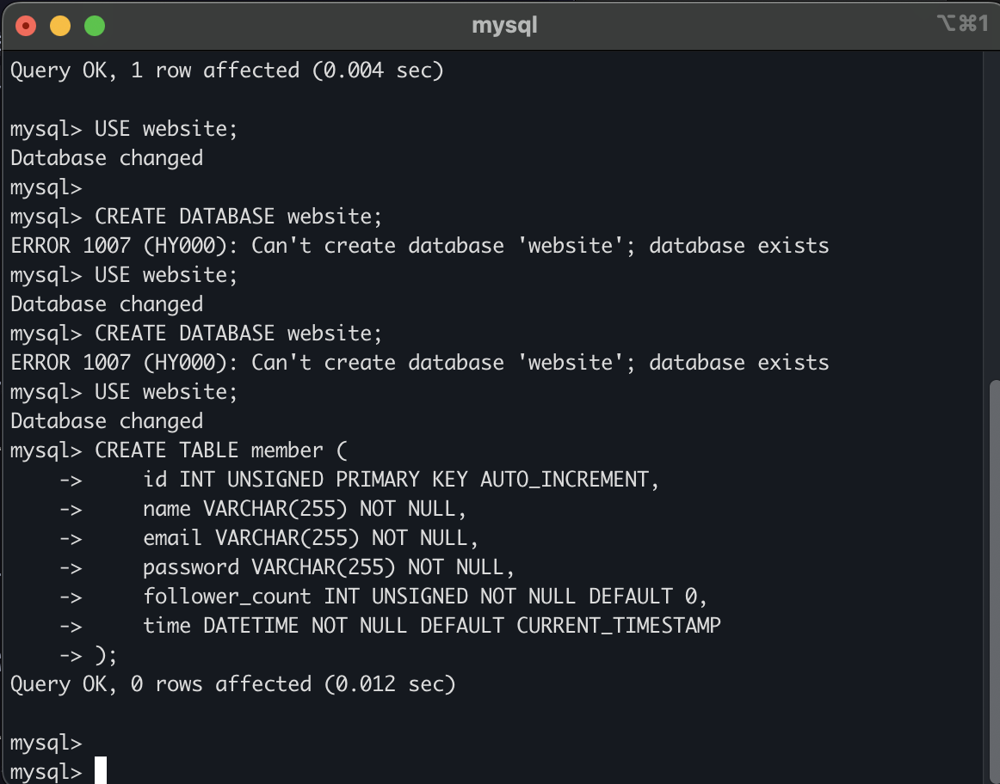

---

## Task 3：SQL CRUD

### 1. INSERT 一筆 test + 額外 4 筆
```sql
INSERT INTO member (name, email, password, follower_count, time) VALUES
('test',    'test@test.com',      'test',      100, '2026-07-01 10:00:00'),
('Jessica', 'jessica@example.com','pw_jessica',300, '2026-07-02 11:00:00'),
('Bob',     'bob@example.com',    'pw_bob',     50, '2026-07-03 12:00:00'),
('Cassie',  'cassie@example.com', 'pw_cassie', 250, '2026-07-04 13:00:00'),
('Dave',    'dave@example.com',   'pw_dave',     0, '2026-07-05 14:00:00');
```
> 註：第一筆的 name/email/password 必須是 test/test@test.com/test；另外 4 筆為任意資料。
> `follower_count` 與 `time` 特意設不同值，方便後面的排序與統計看得出效果。

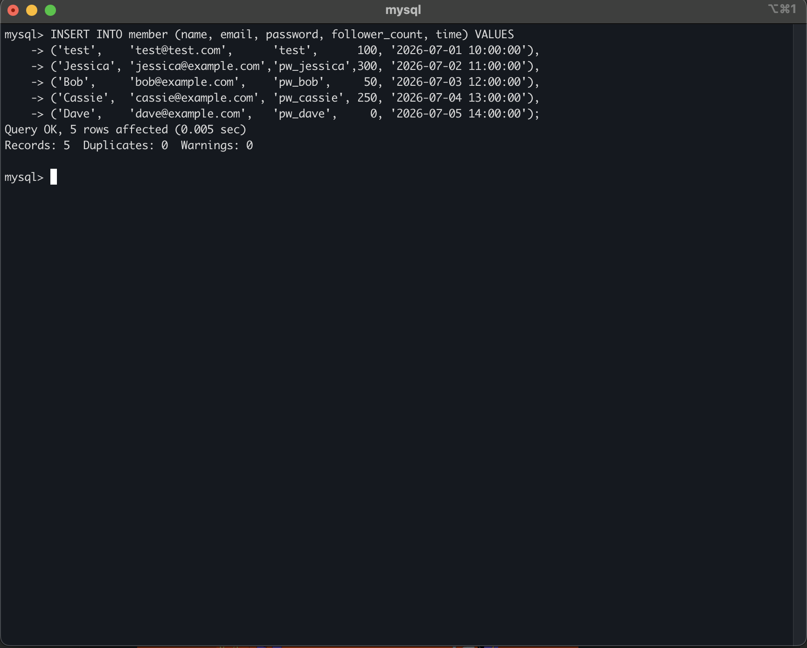

### 2. SELECT 所有資料
```sql
SELECT * FROM member;
```

預期結果：

| id | name | email | password | follower_count | time |
|---|---|---|---|---|---|
| 1 | test | test@test.com | test | 100 | 2026-07-01 10:00:00 |
| 2 | Jessica | jessica@example.com | pw_jessica | 300 | 2026-07-02 11:00:00 |
| 3 | Bob | bob@example.com | pw_bob | 50 | 2026-07-03 12:00:00 |
| 4 | Cassie | cassie@example.com | pw_cassie | 250 | 2026-07-04 13:00:00 |
| 5 | Dave | dave@example.com | pw_dave | 0 | 2026-07-05 14:00:00 |

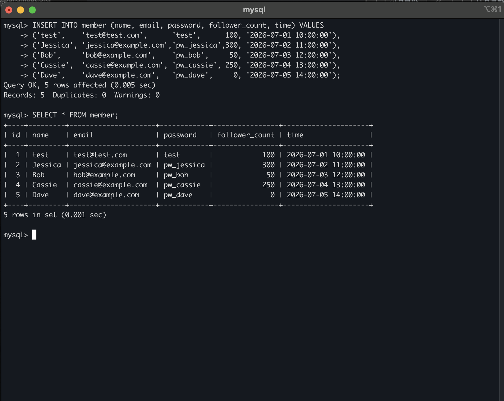

### 3. SELECT 所有資料，依 time 遞減
```sql
SELECT * FROM member ORDER BY time DESC;
```

預期結果（Dave → Cassie → Bob → Jessica → test）：

| id | name | ... | time |
|---|---|---|---|
| 5 | Dave | ... | 2026-07-05 14:00:00 |
| 4 | Cassie | ... | 2026-07-04 13:00:00 |
| 3 | Bob | ... | 2026-07-03 12:00:00 |
| 2 | Jessica | ... | 2026-07-02 11:00:00 |
| 1 | test | ... | 2026-07-01 10:00:00 |

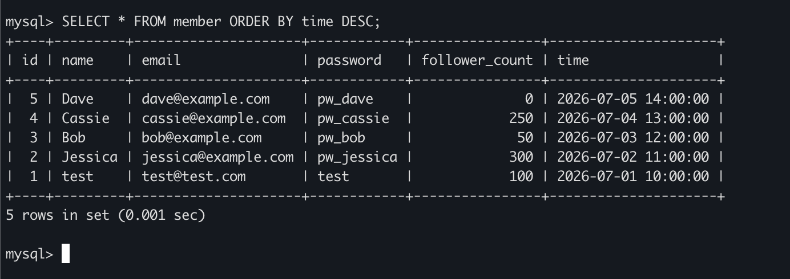

### 4. SELECT 第 2 到第 4 筆（依 time 遞減）
```sql
SELECT * FROM member ORDER BY time DESC LIMIT 3 OFFSET 1;
```
> ⚠️ 這是「排序後位置的第 2~4 個」，不是 id 為 2、3、4。`OFFSET 1` 跳過最新的第 1 筆（Dave），往後取 3 筆。

預期結果（Cassie → Bob → Jessica）：

| id | name | ... | time |
|---|---|---|---|
| 4 | Cassie | ... | 2026-07-04 13:00:00 |
| 3 | Bob | ... | 2026-07-03 12:00:00 |
| 2 | Jessica | ... | 2026-07-02 11:00:00 |

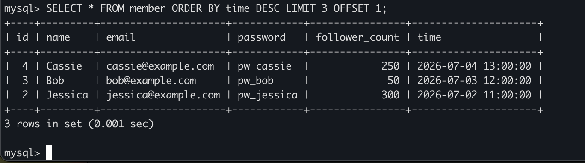

### 5. SELECT email = test@test.com
```sql
SELECT * FROM member WHERE email = 'test@test.com';
```

預期結果：1 筆（id=1, test）。

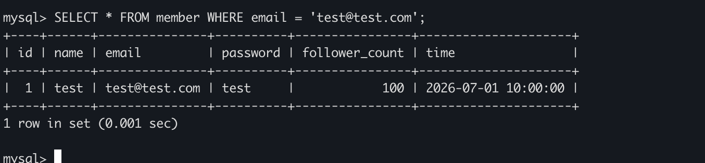

### 6. SELECT name 包含 es 關鍵字
```sql
SELECT * FROM member WHERE name LIKE '%es%';
```

預期結果：test、Jessica 兩筆（都含 "es"）。

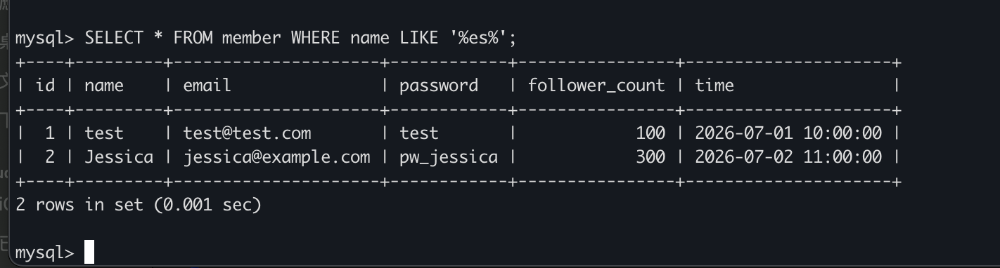

### 7. SELECT email 且 password 皆符合
```sql
SELECT * FROM member WHERE email = 'test@test.com' AND password = 'test';
```

預期結果：1 筆（id=1）。

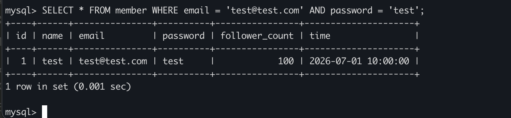

### 8. UPDATE name 改為 test2
```sql
UPDATE member SET name = 'test2' WHERE email = 'test@test.com';
```
> ⚠️ UPDATE 一定要加 WHERE，否則整張表都會被改。

執行後 id=1 的 name 變為 `test2`。

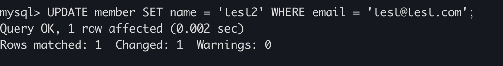

---

## Task 4：SQL 聚合函數

### 1. 共有幾筆
```sql
SELECT COUNT(*) FROM member;
```
預期結果：**5**

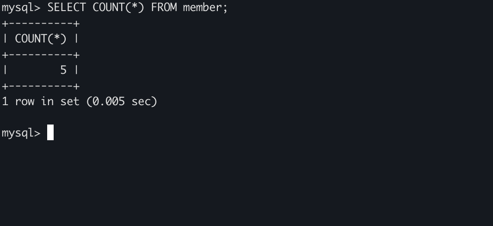

### 2. follower_count 總和
```sql
SELECT SUM(follower_count) FROM member;
```
預期結果：**700**（100+300+50+250+0）

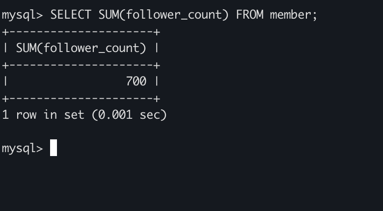

### 3. follower_count 平均
```sql
SELECT AVG(follower_count) FROM member;
```
預期結果：**140.0000**（700 / 5）

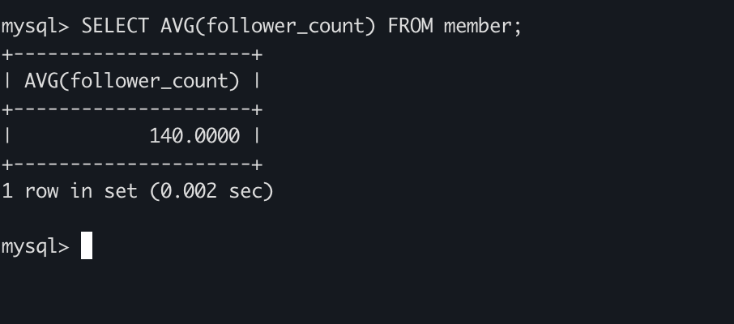

### 4. follower_count 前 2 高的平均
```sql
SELECT AVG(follower_count) FROM (
    SELECT follower_count FROM member ORDER BY follower_count DESC LIMIT 2
) AS top2;
```
> 先用子查詢取出 follower 最高的 2 筆（300、250），外層再算平均。

預期結果：**275.0000**（(300+250) / 2）

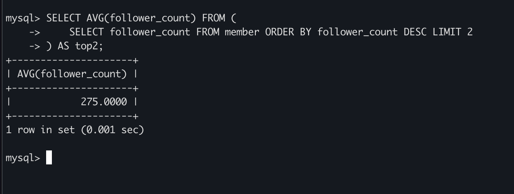

---

## Task 5：SQL JOIN

### 建立 `message` 資料表（含外鍵）
```sql
CREATE TABLE message (
    id INT UNSIGNED PRIMARY KEY AUTO_INCREMENT,
    member_id INT UNSIGNED NOT NULL,
    content TEXT NOT NULL,
    like_count INT UNSIGNED NOT NULL DEFAULT 0,
    time DATETIME NOT NULL DEFAULT CURRENT_TIMESTAMP,
    FOREIGN KEY (member_id) REFERENCES member(id)
);
```
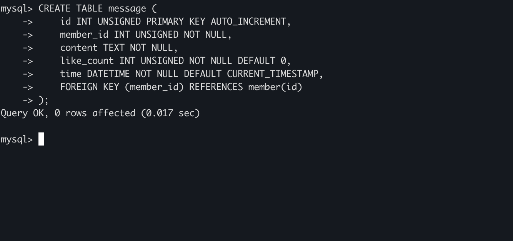

### 塞入測試訊息（供 JOIN 使用）
```sql
INSERT INTO message (member_id, content, like_count, time) VALUES
(1, '這是 test 的第一則留言', 10, '2026-07-06 09:00:00'),
(1, '這是 test 的第二則留言', 20, '2026-07-06 09:05:00'),
(2, 'Jessica 的留言',        30, '2026-07-06 10:00:00'),
(3, 'Bob 的留言',             5, '2026-07-06 11:00:00');
```
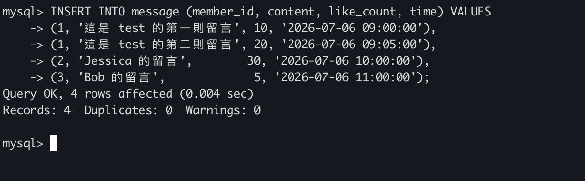

### 1. SELECT 所有訊息 + 發訊者名稱（JOIN）
```sql
SELECT message.*, member.name
FROM message
JOIN member ON message.member_id = member.id;
```

預期結果：

| id | member_id | content | like_count | time | name |
|---|---|---|---|---|---|
| 1 | 1 | 這是 test 的第一則留言 | 10 | 2026-07-06 09:00:00 | test2 |
| 2 | 1 | 這是 test 的第二則留言 | 20 | 2026-07-06 09:05:00 | test2 |
| 3 | 2 | Jessica 的留言 | 30 | 2026-07-06 10:00:00 | Jessica |
| 4 | 3 | Bob 的留言 | 5 | 2026-07-06 11:00:00 | Bob |

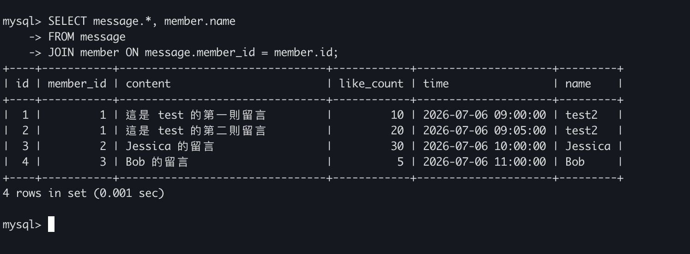

### 2. SELECT 訊息 + 名稱，篩選發訊者 email = test@test.com
```sql
SELECT message.*, member.name
FROM message
JOIN member ON message.member_id = member.id
WHERE member.email = 'test@test.com';
```

預期結果：test2 的 2 則留言（id 1、2）。

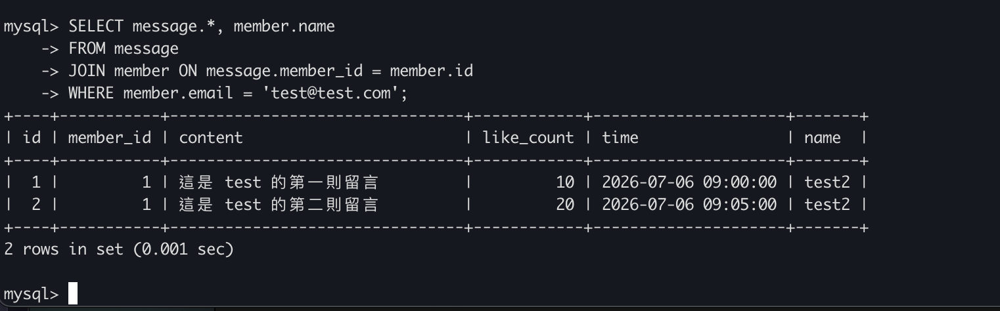

### 3. JOIN + 聚合：該 email 的訊息平均按讚數
```sql
SELECT AVG(message.like_count)
FROM message
JOIN member ON message.member_id = member.id
WHERE member.email = 'test@test.com';
```
預期結果：**15.0000**（(10+20) / 2）

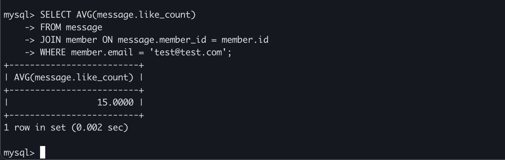

### 4. JOIN + 聚合 + GROUP BY 發訊者 email
```sql
SELECT member.email, AVG(message.like_count)
FROM message
JOIN member ON message.member_id = member.id
GROUP BY member.email;
```

預期結果：

| email | AVG(message.like_count) |
|---|---|
| test@test.com | 15.0000 |
| jessica@example.com | 30.0000 |
| bob@example.com | 5.0000 |

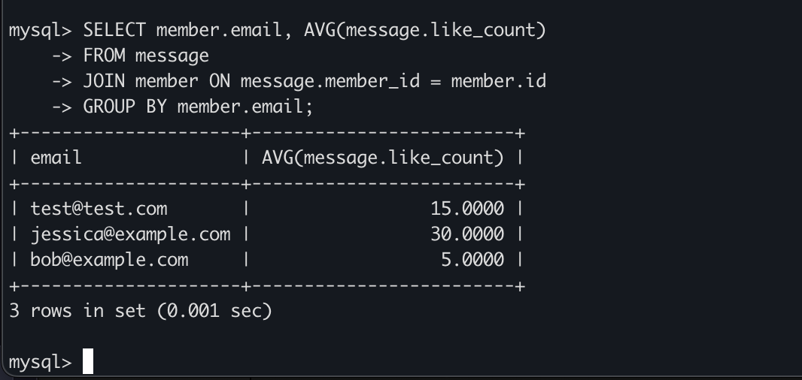
